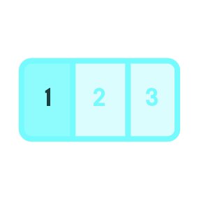

# Spatial Tools

Reference documentation about the functionality of each default tool in the system.

The tools fall into the following categories:

- [Input Tools](#inputTools)
- [Output Tools](#outputTools)
- [Spatial Annotation Tools](#annotationTools)
- [Spatial Organization Tools](#organizationTools)
- [Other Tools](#otherTools)

## Input Tools

These tools primarily act as virtual inputs to the system that you can interact with:

### Switch

||Tapping the on or off buttons toggles its state and emits a 1 or 0 to anything linked to its node.|
|---|---|

### Off Button

||Tapping it sends a 0 to anything linked to its node.|
|---|---|

### On Button

||Tapping it sends a 1 to anything linked to its node.|
|---|---|

### Slider

||Dragging the handle up and down emits a stream of values between 0 (when it's at the bottom) and 1 (when it's at the top) to anything linked to its node.|
|---|---|

### 2D Slider

||Like the regular slider, but has a node for the horizontal position of the handle and a node for the vertical position of the handle. The handle can be dragged to emit values from both nodes.|
|---|---|

### Distance Slider

||When pressing on this tool, emits lower or higher values based on physically moving the device closer or further from the tool.|
|---|---|

### Limiter

||Dragging the yellow touchpad lets you set an upper limit. When data arrives at this tool's node, if it is below the upper limit it will emit a 1, and if it is above the upper limit it will emit a 0.|
|---|---|

### Two-sided Limiter

||Like the regular limiter tool, but you can also set a lower limit. It will emit a 1 if the arriving data is between the two limits.|
|---|---|

## Output Tools

These tools primarily visualize data from the system:

### Graph

||A time series graph that will render an animated plot of the last few seconds of data it has received.|
|---|---|

### Progress Meter

||A simple meter whose green region's height will adjust based on the value it receives.|
|---|---|

### Value

||A decimal readout that will display the value it receives.|
|---|---|

### Counter

||Anytime it receives a new tick, it will increase its count by 1, and display that count. A new "tick" means it receives a high value with a low value in between. Also has a reset button and a reset node to set the count back to 0.|
|---|---|

### Complete (Signal)

||Displays when it receives a high value, and becomes invisible when it receives a low value.|
|---|---|

### In-Progress (Signal)

||Displays when it receives a high value, and becomes invisible when it receives a low value.|
|---|---|

### Warning (Signal)

||Displays when it receives a high value, and becomes invisible when it receives a low value.|
|---|---|

### Error (Signal)

||Displays when it receives a high value, and becomes invisible when it receives a low value.|
|---|---|

## Spatial Annotation Tools

### Draw

||A "sticky note" drawing pad that will persist its contents between users and sessions.|
|---|---|

### Label

||Tapping on it opens the keyboard and allows a user to add a short piece of text.|
|---|---|

### Chat

||A scrollable chat window where users can add notes and messages over time.|
|---|---|

### Beacon

||A non-programmable beacon that can be used to mark or draw attention to a specific location.|
|---|---|

### Video Capture

||Allows a user to record their device's screen and leave a video note that can later be viewed in that location. Has a node to play/pause the video, and previous/next nodes that can be triggered with the previous/next buttons.|
|---|---|

## Spatial Organization Tools

### Envelope

||Tapping on it opens the envelope, at which point other tools can be placed inside it and will become hidden when the envelope is closed. Also has a node that can be triggered to open or close it.|
|---|---|

### Tab Bar

||Switches between tabs 1, 2, and 3 based on the selection node value it receives. When the tabs switch, it emits values from its nodes to turn only the selected tab's connections on. Can be combined e.g. with envelopes to show different tools based on certain conditions.|
|---|---|

## Other Tools

### UI Tutorial 1

||An interactive tutorial for learning how to use the app. Part 1.|
|---|---|

### UI Tutorial 2

||An interactive tutorial for learning how to use the app. Part 2.|
|---|---|

### Easter Egg (Game)

||An example of a simple 2D game that can be dropped into the space as a tool, and controlled by connecting input tools to its nodes. Tap on it to reset.|
|---|---|

### Sphere

||An example of some simple 3D geometry that can be placed into the space.|
|---|---|